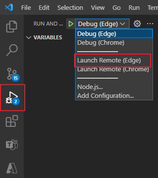

# Overview

At current stage, Teams App has a wealth of features and many applications. At present, however, only the web documents provide information on these features. This way has a weak direct-viewing display effect. Therefore, this Teams App to show Teams Extension (Teams Toolkit) features. The goal is to allow all the developers, especially rookies, of Teams App to easily access it and get a better development experience.

[What is Teams app capabilities](https://aka.ms/teamsfx-capabilities-overview)

# Features

- Simple, intuitive interface for all developers for developers with limited acknowledge and experience on Teams App to be as simple and intuitive as possible.
- Efficient – since reading documents and finding APIs on webs is time consuming, this App had to be efficient with examples such as getting the user information, uploading/downloading files and showing UI components.
- Cross platform[optional] – the App be available across 2 platforms: Teams Client and Mobile Teams App. The app will be designed adaptively to achieve the same experience both on computers and mobile phones.

# Structure

## App

### Teams Toolkit

This part shows Teams Extension (Teams Toolkit) features, there are GIF pictures to display almost all the features giving tips:

- **GETTING STARTED**: information about how to create an App by using a sample
- **PROJECT**: includes Create New Project, Add Capabilities, Deploy to the Cloud and so on. You can create your own App and publish it on the Azure or Teams just in Visual Studio Code.

### Teams Dev

This part shows how to use Teams App ability step by step and [Microsoft Graph API](https://developer.microsoft.com/en-us/graph/graph-explorer) in Teams, there are GIF pictures to display some features and giving tips on [@microsoft/teams-js](https://docs.microsoft.com/en-us/javascript/api/@microsoft/teams-js/?view=msteams-client-js-latest) and [@microsoft/teamsfx](https://docs.microsoft.com/en-us/javascript/api/@microsoft/teamsfx/?view=msteams-client-js-latest) SDK:

- **Tab**: includes Deeplink/Mobile tab[optional]/Static Tab - [README](./tabs/README.md)
- **Bot**: includes Adaptive Card - [README](./bot/README.md)
- **Messaging Extension**: includes Action Commands/Search Commands/Link Unfurling

### UI

**@fluentui/react-northstar** - A themable React component library.

The UI components are derived from [@fluentui/react-northstar](https://fluentsite.z22.web.core.windows.net/0.57.0/) and are divided into 3 parts:

- **Overall**: includes theming and layout aspects components
- **Component**: logically divided into multiple parts instead of sorting in alphabetical order
- **Prototypes**: includes complex or combined components

# Prerequisites

- [Node.js](https://nodejs.org/en/) (use the latest v14 LTS release)
- An M365 account. If you do not have M365 account, apply one from [M365 developer program](https://developer.microsoft.com/en-us/microsoft-365/dev-program)
- A browser with developer tools, such as, [Microsoft Edge](https://www.microsoft.com/en-us/edge) (recommended) or Google Chrome
- Install [Visual Studio Code](https://code.visualstudio.com/download), version 1.55 or later.
- [Teams Toolkit Visual Studio Code Extension](https://aka.ms/teams-toolkit) or [TeamsFx CLI](https://aka.ms/teamsfx-cli)

# Enable Sideloading
1. Sign in to [Microsoft 365 admin center](https://admin.microsoft.com/Adminportal/Home?source=applauncher#/homepage#%2F)
2. select **Show all > Teams**

3. Navigate to **Teams apps > Setup Policies > Global**.

4. Toggle Upload custom apps to the **On** position.
5. Select **Save**. Your test tenant can permit custom app sideloading.

# Getting Started
To use the app in Teams, download the [release](https://github.com/t-lji/fx-example/releases/tag/v1.0.0) zip file first.

1. Upload this app to your Teams

  - 1.1 Press `...` and choose **More app** Or Press **App** icon in the left bottom
  - 1.2 Press **Upload a custom app**
2. Upload `appPackage.zip`
3. Sideload App by directly press **Add** (recommended) or add this app to your channel

4. Enjoy exploring the App!
  - 4.1 Sideload:

  
  
  - 4.2 channel:
  
  

# Debug/Run project
- Debug: Open Debug View (`Ctrl+Shift+D`), select **Debug Remote (Edge)**, then Click  `start Debugging` or Press `F5`
- Run: Open Debug View (`Ctrl+Shift+D`), select **Launch Remote (Edge)**, then Click  `start Debugging` or Press `F5`

# Collaboration
`Attention`: The M365 Account of Collaborators shoule be the same tenant with the owner of the App.

1. Sign in to [Microsoft 365 admin center](https://admin.microsoft.com/Adminportal/Home?source=applauncher#/homepage#%2F)
2. select **Users > Active users**, add user to your tenant

3. Sign in to [Azure Portal](https://ms.portal.azure.com/#home)
4. Search for Users, add New user or Invite user

5. Choose to Create user or Invite user

6. Accept the invitation in your mailbox

7. Select **Azure Active Directory > App registrations > Your App > Owners**, then add owner

8. Sign in to [Developer Portal](https://dev.teams.microsoft.com/home)
9. Choose app, and add owners of your app

